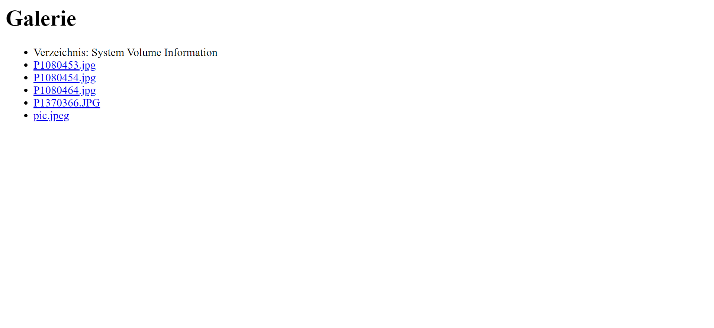
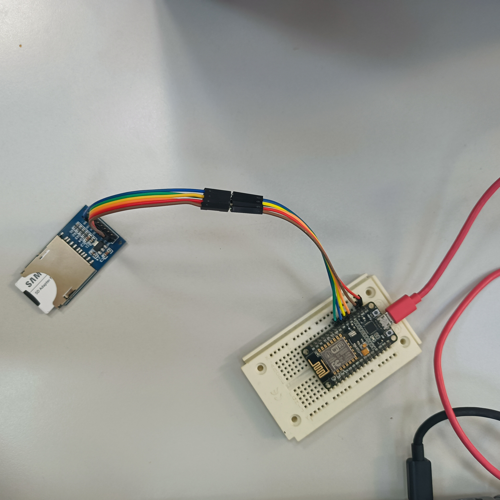

# ESP8266 Bildergalerie

## Übersicht
Dieses Beispiel zeigt, wie man mit einem ESP8266 und einer SD-Karte eine webbasierte Bildergalerie erstellt. Der ESP8266 dient als Webserver und liefert eine HTML-Seite, die die auf der SD-Karte gespeicherten Bilddateien auflistet und zum Herunterladen bereitstellt.

## Einrichtung
1. **Abhängigkeiten:**  
   - ESP8266WiFi  
   - ESPAsyncWebServer  
   - SD  
2. **Hardware:**  
   - ESP8266-Board  
   - SD-Kartenleser, verbunden mit dem ESP8266  
3. **WLAN-Zugangsdaten:**  
   - Ändere `ssid` und `password` entsprechend deinem Netzwerk.  
   - Der AP-Modus ist mit `ap_ssid` und `ap_password` verfügbar.  

## Endpunkte

### `GET /`
Zeigt die Bildergalerie an.  
- **Antwort:** HTML-Seite mit einer Liste der Bilddateien von der SD-Karte.  

### `GET /download?file=<filename>`
Lädt die angegebene Bilddatei herunter.  
- **Parameter:**  
   - `file`: Name der herunterzuladenden Datei.  
- **Antwort:**  
   - Erfolg: Die Bilddatei.  
   - Fehler: 404 "Datei nicht gefunden."  

## Projekt ausführen
1. Lade den Code auf deinen ESP8266.  
2. Öffne den Seriellen Monitor, um die IP-Adresse zu erhalten.  
3. Öffne einen Webbrowser und rufe `http://<IP_ADRESSE>` auf.  

## Einschränkungen  
- Keine Seitennummerierung; alle Dateien werden auf einer Seite aufgelistet.  

## Zukünftige Verbesserungen
- Unterstützung für weitere Bildformate hinzufügen.  
- Seitennummerierung oder Lazy Loading für eine große Anzahl von Dateien implementieren.  
